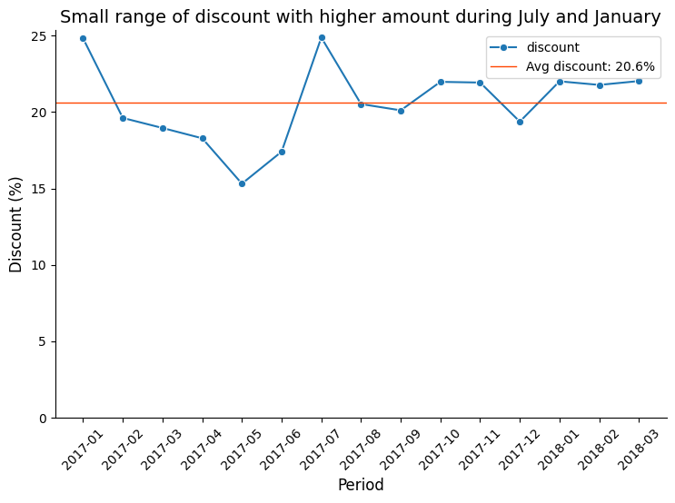

### **The "Eniac Discount" Version (Following your preferred style)**

**Project Overview**
Eniac, a premium Apple reseller, faced a strategic deadlock between high-volume discounting and brand profitability. This project evaluates the efficiency of their discounting strategy by analyzing over 1 year (01/2017 - 03/2018) of internal sales data. By correlating discount depth with seasonal demand and volume, I provided a data-driven recommendation to pivot from a constant discounting strategy (with irregular %) to a "5% Newsletter Lead" strategy to protect **Contribution Margins (CM1)** and brand prestige.

**📊 Dataset & Sources**
*   **Source:** Integrated CSV datasets (Orders, Orderlines, Products, Brands).
*   **Size:** ~[Insert Number] orders spanning 2017 to 2018.
*   **Key Features:** `check_orders`, `price`, `unit_price`, `discount_percentage`, `order_date`, and `product_category`.
*   **Preprocessing:** Filtered for "Completed" orders and removed outliers/mouldy data. Merged disparate tables to calculate the exact discount per line item. Categorized products into "Anchors" (iPhones/Macs) and "Accessories" to identify price elasticity.

**🚀 Key Findings & Results**
*   **The Seasonality Illusion:** Analysis revealed that Q4 2017 and Q1 2018 growth was driven by market cycles (Black Friday/New Year), not the depth of discounts. Sales volume remained high even when discounts were minimal.
*   **The "Revenue Gap" Risk:** 1/3 of sales occurred at >25% discount. Without factoring in CAC and COGS, the company is basically guessing breakpoint blindly. These sales are at risk with a negative **Net Contribution**, essentially "paying" to acquire customers at a loss.
*   **The 5% Lead Solution:** Proposed a pivot to a 5% "Welcome" discount. This captures the customer's email (Lead), allowing for zero-cost remarketing and protecting the margin on high-end "Anchor" products.
*   **A/B Testing Roadmap:** Identified a need for price elasticity testing to prove that Eniac's "Quality Segment" customers are less price-sensitive than Marketing assumed.

**🛠️ Technologies Used**
*   **Analysis & Cleaning:** Python (Pandas, Seaborn)
*   **Visualization:** Matplotlib / Seaborn
*   **Communication:** Prezi

*   📁**Project Structure**
  

* Irregular discount throughout the year
