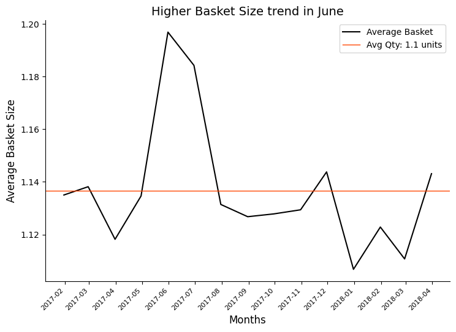
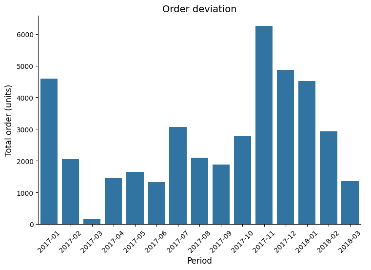
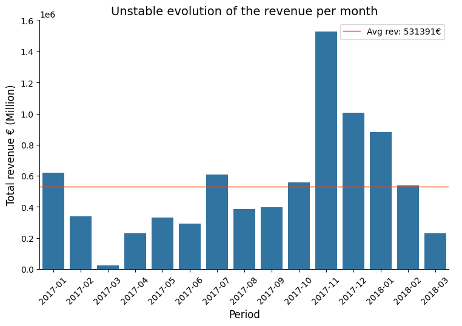

### **The "Eniac Discount" Version (Following your preferred style)**

**Project Overview**
Eniac, a premium Apple reseller, faced a strategic deadlock between high-volume discounting and brand profitability. This project evaluates the efficiency of their discounting strategy by analyzing over 1 year (01/2017 - 03/2018) of internal sales data. By correlating discount depth with seasonal demand and volume, I provided a data-driven recommendation to pivot from a constant discounting strategy (with irregular %) to a "5% Newsletter Lead" strategy to protect **Contribution Margins (CM1)** and brand prestige.

**📊 Dataset & Sources**
*   **Source:** Integrated CSV datasets (Orders, Orderlines, Products, Brands).
*   **Size:** ~[Insert Number] orders spanning 2017 to 2018.
*   **Key Features:** `order_id`, `price`, `unit_price`, `discount`, `date`,`unit_price_paid`,`type` and `product_category`.
*   **Preprocessing:** Filtered for "Completed" orders and removed outliers/mouldy data. Merged disparate tables to calculate the exact discount per line item. Categorized products into "Anchors" (iPhones/Macs) and "Accessories" to identify price elasticity.

**🚀 Key Findings & Results**
*   **The Seasonality Illusion:** Analysis revealed that Q4 2017 and Q1 2018 growth was driven by market cycles (Black Friday/New Year), not the depth of discounts. Sales volume remained high even when discounts were minimal.
*   **The "Revenue Gap" Risk:** 1/3 of sales occurred at >25% discount. Without factoring in CAC and COGS, the company is basically guessing breakpoint blindly. These sales are at risk with a negative **Net Contribution**, essentially "paying" to acquire customers at a loss.
*   **The 5% Lead Solution:** Proposed a pivot to a 5% "Welcome" discount. This captures the customer's email (Lead), allowing for zero-cost remarketing and protecting the margin on high-end "Anchor" products.
*   **A/B Testing Roadmap:** Identified a need for price elasticity testing to prove that Eniac's "Quality Segment" customers are less price-sensitive than Marketing assumed.

**🛠️ Technologies Used**
*   **Analysis & Cleaning:** Python (Pandas, Seaborn)
*   **Visualization:** Matplotlib / Seaborn
*   **Communication:** Prezi

*   📁**Project Structure**
  

* Irregular discount throughout the year

* Only peak in July above average

* Following seasonality rather than discount setting

* Following seasonality rather than discount setting

**Final recommendations:**
- Remove all discounts
- Offer a 5% discount for New Customers via Newletters (and gather Leads)
- Run A/B testings for topsellers to measure "Are sales driven by tag or price"
- Offer Tiered Pricing during Black Friday/Christmas or Summer Sales
  - Guarantee a high AOV
  - Saves margins for cheaper products

 
**Additional Reflections**
- **The corrupted data**: During Quality Assessment, a _chunk_ of the tables were dropped as their values were odd (filled with mistakes, not following a similar pattern, not clear enough)

- **The "Data Blind Spot"**: One major takeaway was the impact of missing data. Analyzing discounting efficiency without COGS and CAC is like "navigating with half a map." My analysis shifted from a definitive financial audit to a strategic risk assessment, highlighting the urgent need for cross-departmental data transparency.

- **The Psychology of Discounting**: I realized that "Price Training" is a real risk for premium brands. By constantly varying discount percentages, Eniac may have conditioned its most loyal customers to wait for a "drop" rather than buying based on need or quality. The pivot to a 5% Newsletter Lead isn't just a financial move; it's a brand-rehabilitation move.

- **The Seasonality Trap**: This project reinforced the importance of using Time-Series Analysis to isolate "organic growth" from "bought growth."

- **The Conflict of Interests**: This project was a lesson in stakeholder management. I had to find a "Middle Ground" that satisfied Marketing’s need for leads and the Board’s need for margins. Data served as the objective mediator in a subjective corporate debate.
